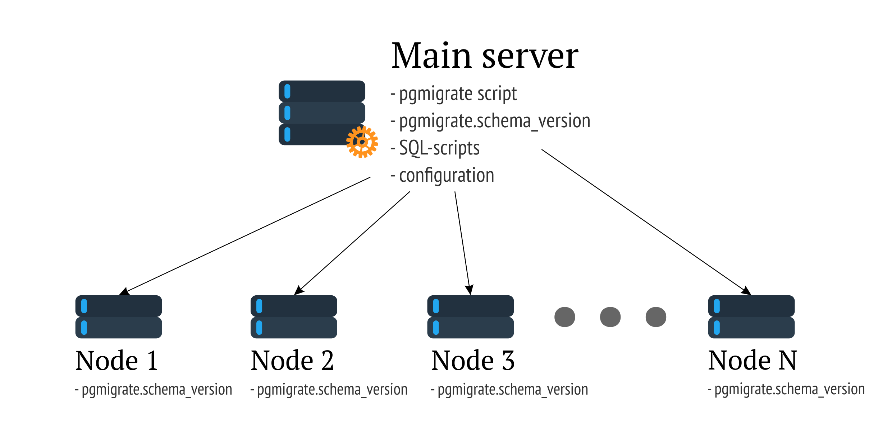

#pgmigrate

The module is based on <https://github.com/yandex/pgmigrate>.

Video on the initial development:

<https://www.youtube.com/watch?v=LqB1DA6fJB8>

 

#### Features of the original:

- Information about the versions in the form of records in the database.

- Migrations made in the form of files containing only SQL-statements.

- Transactional and non-transactional migration.

- Online migration.

- Callbacks.

- Dry-run.

Information about the possibilities can be found in the video above ...

Innovations in comparison with the original:

- The possibility of downgrade (degradation scheme).

- Ability to spill migration through the server pool.

 

#### Principle of work:

To run the script on the machine with which it is supposed to start the process
you need to create a directory and add all the necessary directories
and files, namely:

- The configuration file migrations.yml

- A directory with migration files - migrations

- A directory with migration rollback files - downgrades

- A directory with callbacks, which in turn is divided into several directories:

    - afterAll - the files inside this directory are executed after each start of the migration process;

    - afterEach - perform after each migration;

    - beforeAll - execute before starting the migration process;

    - beforeEach - executed after each migration

- Catalog with grants - files from it are executed after afterAll-operators.

The composition and names of all entities can be edited in the configuration file.

In addition, in all databases where migration will be spread, it is necessary to create
pgmigrate scheme. At the first start in this scheme, a table will be created
sсhema_version, in which data about the applied migrations will be recorded.

Migrations are stored in files of the form V\<migration number\> __\<description of migration\>. Sql,

The rollback files have names of the same format. In both cases, the migration numbers
In essence, they contain the number of the state of the database in which it appears after execution
all operators from a file.

It is desirable to try to do transactional migrations in order not to leave the base in
an unfavorable state. This will not be obtained in cases where it is necessary
will execute migrations that contain, for example, CREATE INDEX CONCURRENTLY (which
will not affect integrity) and/or ALTER TYPE ... ENUM. The script stops with
an exception is thrown, if the execution fails on either of the nodes, or
The node could not connect. Errors important stages of work are written in the log.
Transactionality is maintained at the cluster level - if on one of the machines
an error occurred and migration did not apply, then the whole process is rolled back at all
nodes.

The module is managed by a configuration file in YAML format. It is also stored there
list of connection strings to servers - adding/removing nodes is very easy -
just fix the file.
