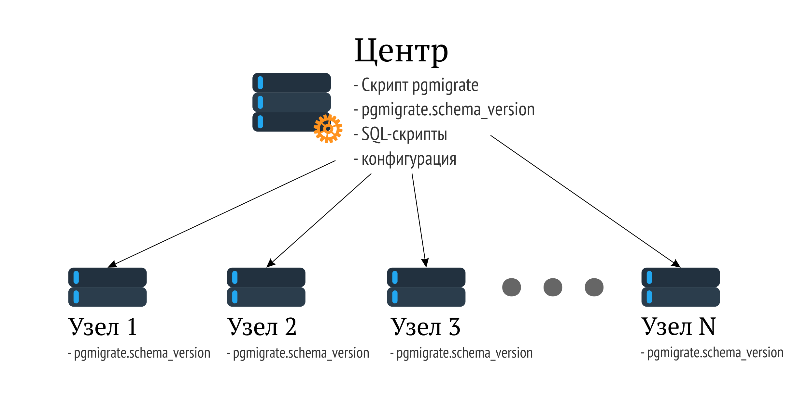

#pgmigrate

Модуль основан на <https://github.com/yandex/pgmigrate>.

Видео по исходной разработке:

<https://www.youtube.com/watch?v=LqB1DA6fJB8>

 

#### Возможности оригинала:

-   Информация о версиях в виде записей в базе данных.

-   Миграции, оформленные в виде файлов, содержащих только SQL-операторы.

-   Транзакционные и нетранзакционные миграции.

-   Онлайн-миграции.

-   Коллбэки.

-   Dry-run.

Информацию о возможностях можно почерпнуть из видео выше…

Нововведения по сравнению с оригиналом:

-   Возможность downgrade (деградации схемы).

-   Возможность разлива миграций по пулу серверов.

 

#### Принцип работы:

Для работы скрипта на машине, с которой предполагается запускать процесс
миграции, необходимо создать директорию и сложить туда все необходимые каталоги
и файлы, а именно:

-   Файл конфигурации migrations.yml

-   Каталог с файлами миграций – migrations

-   Каталог с файлами отката миграций – downgrades

-   Каталог с коллбэками, который в свою очередь делится на десколько диреторий:

    - afterAll – файлы внутри этой директории выполняются после каждого запуска процесса миграции;

    - afterEach – выполнять после каждой миграции;

    - beforeAll – выполнять перед началом процесса миграции;

    - beforeEach – выполняются после каждой миграции

-   Каталог с грантами – файлы из него выполняются после afterAll-операторов.

Состав и названия всех сущностей можно править в конфигурационном файле.

Кроме того, во всех базах, куда будут разливаться миграции необходимо создать
схему pgmigrate. При первом запуске в этой схеме будет создана таблица
sсhema_version, в которую будут записываться данные о примененных миграциях.

Миграции хранятся в файлах вида V\<номер миграции\>__\<описание миграции\>.sql,

Файлы отката имеют имена такого же формата. В обоих случаях номера миграций
содержат, по сути, номер состояния базы, в котором она окажется после выполнения
всех операторов из файла.

Желательно стараться делать транзакционные миграции, чтобы не оставлять базу в
неконсистентном состоянии. Это не будет получаться в случаях, когда необходимо
будет исполнять миграции, содержащие, например, CREATE INDEX CONCURRENTLY (что
не повлияет на целостность) и/или ALTER TYPE … ENUM. Скрипт останавливается с
генерацией исключения, если выполнение завалилось на каком-либо из узлов, либо к
узлу не удалось подключиться. Ошибки значимые этапы работы пишутся в лог.
Транзакционность поддерживается на уровне кластера – если на одной из машин
произошла ошибка и миграция не применилась, то весь процесс откатывается на всех
узлах.

Управляется модуль конфигурационным файлом в формате YAML. Там же хранится
список строк подключений к серверам – добавлять/удалять узлы очень легко –
просто поправить файл.
